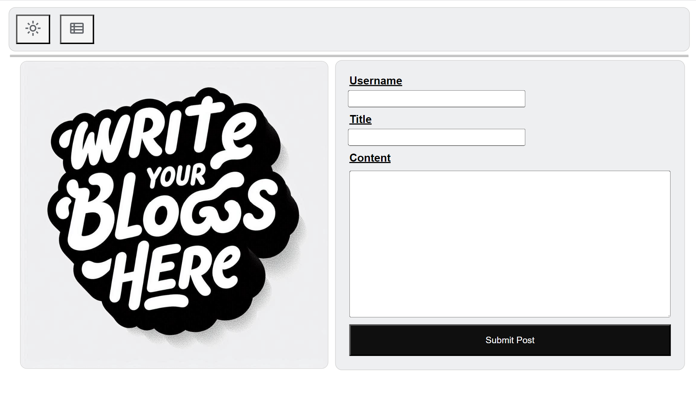
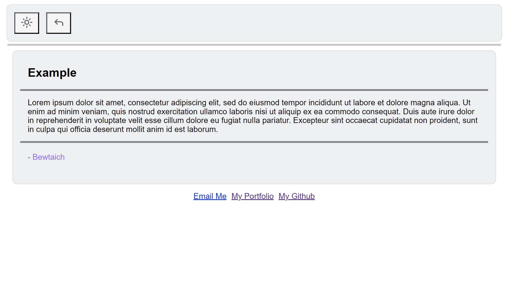
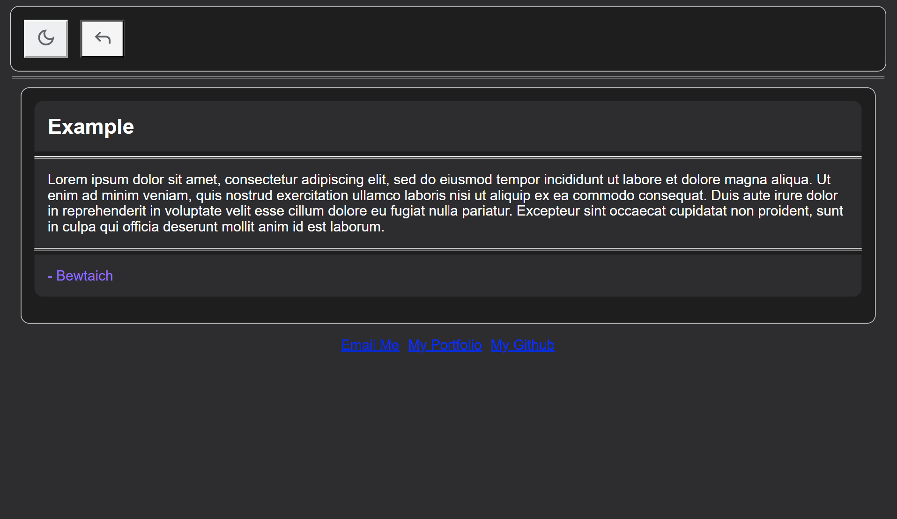

## blog-site

## Description

This app lets you write and post personal blogs.
There is a form to fill out and create your posts on one page and
another page that lets you view all of your posts. It provides
a hub for your thoughts, memos, ideas. Whatever it is you want 
to write and keep a log of, it's easily viewable in one
organized location.

## Usage
To create a blog, fill out all the input fields and then hit "Submit Post."
Buttons are on top to navigate between the form and the posted blogs.
Clicking the Sun or Moon on top will also allow you to change your
display to light or dark mode based on your preference.
Links to my work are listed below your posts as well.

## Website Link

https://bewtaich.github.io/blog-site/

## License

See MIT License in repo

